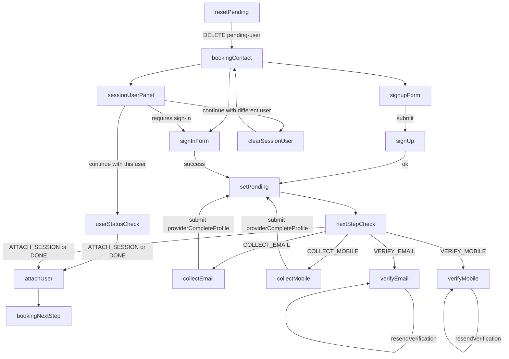

# Booking Contact Flow

## Scope

This document covers the booking contact step only, using the embedded signup flow on the booking contact page (no separate `/auth/sign-up` path). Required signup fields: given name, family name, email, mobile, password, confirm.

## Inputs and APIs

- Session state: `session`, `authUser`, `sessionUser`, `requirements`, `pendingUser`.
- Booking endpoints:
  - `GET /public/appointment-session/{sessionId}/requirements`
  - `GET /public/appointment-session/{sessionId}/user-status`
  - `GET /public/appointment-session/{sessionId}/pending-user`
  - `POST /public/appointment-session/{sessionId}/set-pending-user`
  - `DELETE /public/appointment-session/{sessionId}/pending-user`
  - `POST /public/appointment-session/{sessionId}/attach-user`
  - Clear session user endpoint (newly generated; confirm exact path/method)
- Identity endpoints:
  - `signUp`
  - `signIn` (LOCAL or provider)
  - `providerCompleteProfile`
  - `resendVerification`
  - `verificationSessionToken` (from `signUp`, used to resend verification without auth)

## NextStep rules

`nextStep` drives UI state and follow-up requests:

- `COLLECT_EMAIL` → collect email before continuing.
- `COLLECT_MOBILE` → collect mobile before continuing.
- `VERIFY_EMAIL` → prompt for email verification, allow resend.
- `VERIFY_MOBILE` → prompt for SMS verification, allow resend.
- `ATTACH_SESSION` or `DONE` → attach and continue to next booking step.

## Flow narrative (explicit response handling)

### Signup (embedded form)

1. User submits valid form (name, email, mobile, password).
2. Call `signUp`.
3. If `nextStep` = `SIGN_IN`:
   - Call `signIn` (LOCAL) immediately with the same credentials.
   - On success → `set-pending-user`, then `attach-user`.
   - Continue to next booking step.
4. If `nextStep` = `VERIFY_*`:
   - Store `verificationSessionToken` from the response.
   - Stay on contact page and show next-step panel.
   - Allow resend via `resendVerification` using `verificationSessionToken` (no auth).
5. If `nextStep` = `COLLECT_*`:
   - Stay on contact page and show next-step panel.
   - Prompt user to sign in if collection requires auth.

### Sign-in (LOCAL or provider)

1. User signs in via local form or provider.
2. On success → call `set-pending-user`.
3. If `nextStep` = `COLLECT_*`:
   - Show profile completion form.
   - Submit via `providerCompleteProfile`.
4. If `nextStep` = `VERIFY_*`:
   - Show verification required panel.
   - Allow `resendVerification`.
5. If `nextStep` = `ATTACH_SESSION` or `DONE`:
   - Call `attach-user`.
   - Continue to next booking step.

### Session user attached but visitor not logged in

1. Show session user details (name, email, mobile, verification status).
2. “Fortsett med denne brukeren” requires sign-in first:
   - Prompt local/provider sign-in.
   - If logged-in user matches session user → attach and continue.
   - If mismatch → show mismatch warning and do not attach.
3. If session user has verified both email and mobile:
   - Show the signup accordion (create different user).

### Provider complete profile

1. Submit missing email/mobile via `providerCompleteProfile`.
2. On success → call `set-pending-user`.
3. If `nextStep` = `ATTACH_SESSION` or `DONE` → attach and continue.
4. Otherwise show next-step panel and keep pending state visible.

## UI state handling

### pendingUser present

- Show status panel with `nextStep` copy.
- Show session user details (name, email, mobile, verification status).
- Primary CTA: “Fortsett med denne brukeren”.
- If email or mobile is not verified, show resend actions for the unverified channels.
- If `COLLECT_*` → show minimal input form and submit to `providerCompleteProfile`.
- If `VERIFY_*` → show resend button.
- Hide main sign-in/sign-up forms.
- Show Reset CTA.

### signup response without pending user

- When `signUp` returns `VERIFY_*`, show next-step panel inside signup accordion.
- Include resend CTA using `verificationSessionToken` and display email/SMS delivery status.

### sessionUser exists but visitor not logged in

- Show session user summary (name, email, mobile, verification status).
- Primary CTA: “Fortsett med denne brukeren”.
  - Prompts sign-in first, then attach on match.
- If the session user is fully verified (email + mobile), show the signup accordion.
- Secondary CTA: “Fortsett med en annen bruker”.
  - Call clear session user endpoint.
  - Reset UI to the normal sign-in/sign-up view.

### authUser matches sessionUser

- Show user summary.
- Allow continue (attach if `nextStep` allows).

### authUser mismatch

- Show warning that logged in user differs from session user.
- Show sign-in options and “create different user”.

## Reset behavior

- Reset CTA is visible whenever a pending user exists.
- On click → `DELETE /pending-user`.
- UI resets: clear form inputs and collapse signup accordion.

## Continue with different user

- Visible when a session user exists and visitor is not logged in.
- On click → clear session user endpoint.
- After clear: show the default sign-in/signup state and remove the session summary panel.

## Flow plans (per variation)

### Plan: pendingUser present

1. Fetch `pendingUser`, `sessionUser`, `requirements` on loader.
2. Render status panel with `nextStep` copy.
3. Render session user details (name, email, mobile, verification status).
4. Render “Fortsett med denne brukeren” CTA (prompts sign-in if not authenticated).
5. Render resend actions for any unverified channels (email/SMS).
6. If `COLLECT_*`, render minimal profile completion and submit `providerCompleteProfile`.
7. If `VERIFY_*`, render resend CTA(s).
8. Hide main sign-in/sign-up forms.
9. Show Reset CTA → `DELETE /pending-user`, then clear UI state.

### Plan: signup response without pending user

1. Submit embedded signup form.
2. On `VERIFY_*`, store `verificationSessionToken`.
3. Show next-step panel inside the signup accordion.
4. Show resend CTA with `verificationSessionToken` and display delivery status.
5. Keep user on contact step until verification completes.

### Plan: sessionUser exists but visitor not logged in

1. Show session user summary (name, email, mobile, verification status).
2. Primary CTA “Fortsett med denne brukeren” → prompt sign-in.
3. On sign-in:
   - If auth user matches session user → attach and continue.
   - If mismatch → show mismatch warning and block attach.
4. If session user fully verified → show signup accordion for different user.
5. Secondary CTA “Fortsett med en annen bruker” → clear session user and reset UI.

### Plan: sign-in (LOCAL or provider)

1. Submit sign-in (LOCAL or provider).
2. On success → `set-pending-user`.
3. If `COLLECT_*` → show profile completion and call `providerCompleteProfile`.
4. If `VERIFY_*` → show verification panel and allow resend.
5. If `ATTACH_SESSION` or `DONE` → attach and continue to next step.

### Plan: signup (embedded form)

1. Submit sign-up (name, email, mobile, password).
2. If `nextStep` = `SIGN_IN`:
   - Sign in immediately.
   - `set-pending-user` → `attach-user` → continue.
3. If `nextStep` = `VERIFY_*`:
   - Store `verificationSessionToken`.
   - Show next-step panel and resend CTA.
4. If `nextStep` = `COLLECT_*`:
   - Show next-step panel; prompt sign-in if required for collection.

### Plan: provider complete profile

1. Submit missing email/mobile via `providerCompleteProfile`.
2. On success → `set-pending-user`.
3. If `ATTACH_SESSION` or `DONE` → attach and continue.
4. Otherwise show next-step panel and keep pending state visible.

### Plan: authUser matches sessionUser

1. Show auth user summary.
2. If `nextStep` allows → attach and continue.

### Plan: authUser mismatch

1. Show mismatch warning.
2. Keep sign-in options visible.
3. Allow “create different user” (signup accordion).

## Mermaid flow

