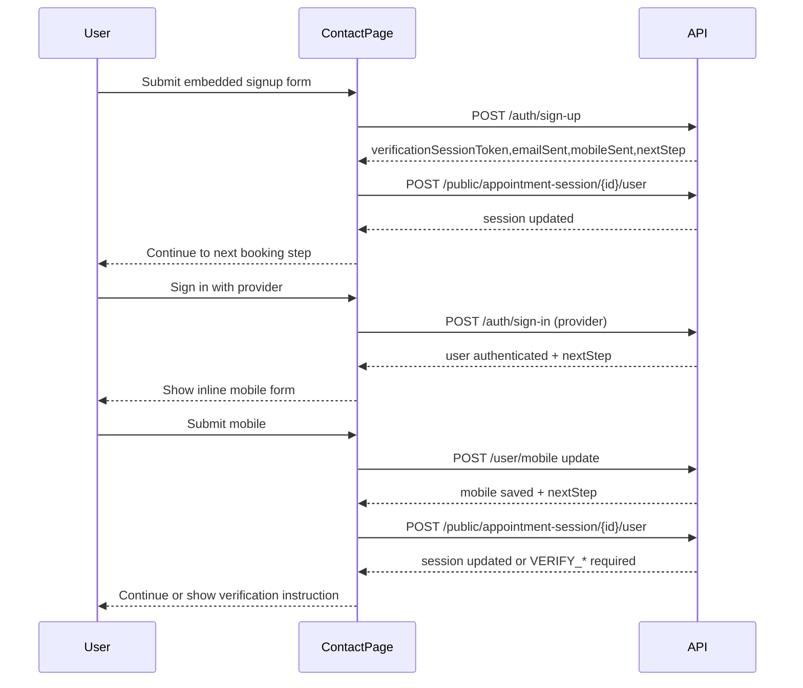

# Booking Session Signup Plan

## Goal

Add a user creation form directly inside the public booking contact step, require mobile capture for provider logins, and enforce email/mobile verification gates before attaching the user to the booking session.

## Current flow touchpoints

- Contact step route: [`/Users/adambaser/Documents/portal.baser-it/app/routes/booking/public/appointment/session/contact/booking.public.appointment.session.contact.route.tsx`](file:///Users/adambaser/Documents/portal.baser-it/app/routes/booking/public/appointment/session/contact/booking.public.appointment.session.contact.route.tsx)
- Booking session creation and transitions: [`/Users/adambaser/Documents/portal.baser-it/app/routes/booking/public/appointment/session/booking.public.appointment.session.route.tsx`](file:///Users/adambaser/Documents/portal.baser-it/app/routes/booking/public/appointment/session/booking.public.appointment.session.route.tsx)

## Planned UX

- Contact step shows two options:
  - Existing path (Google sign‑in) remains, but after login an inline mobile form appears if mobile is missing.
  - New embedded “Opprett bruker” form with fields: first name, last name, email, mobile (required), password, confirm password.
- After successful signup, immediately attach the new user to the current booking session and continue to the next step.
- After provider login, require mobile submission before attaching the user to the session or continuing.
- If backend returns VERIFY_EMAIL or VERIFY_MOBILE, show verification instructions and block session attach until verified.
- Show inline error messages for signup and mobile validation errors.

## Data flow

## Implementation steps

- Update the contact route action to handle a new form intent (e.g. `action=signup`) and call `AuthController.signUp` with mobile required.
- After provider login, detect missing mobile and render an inline mobile form; on submit, call the relevant update endpoint and then attach session.
- On signup success, call `PublicAppointmentSessionController.submitAppointmentSessionUser` with the new user id (or retrieved user data) and redirect to the next booking step.
- Respect backend `nextStep` for verify-email/mobile and block attach until verified.
- Render the embedded signup form below the existing sign-in UI using existing auth form components for consistent styling.
- Add validation feedback and ensure mobile is marked as required in the form.

## UI consistency

- Reuse existing auth components: `AuthFormContainer`, `AuthFormField`, `AuthFormButton` where appropriate.
- Keep booking contact layout consistent (same spacing, card, typography as current step).

## Notes / assumptions

- Provider login returns tokens or a user id usable to attach to the session. If not, we will need a follow‑up API call to fetch user info from the token.
- Mobile is mandatory in this embedded flow.
- Attach session should only succeed when email and mobile are verified.
