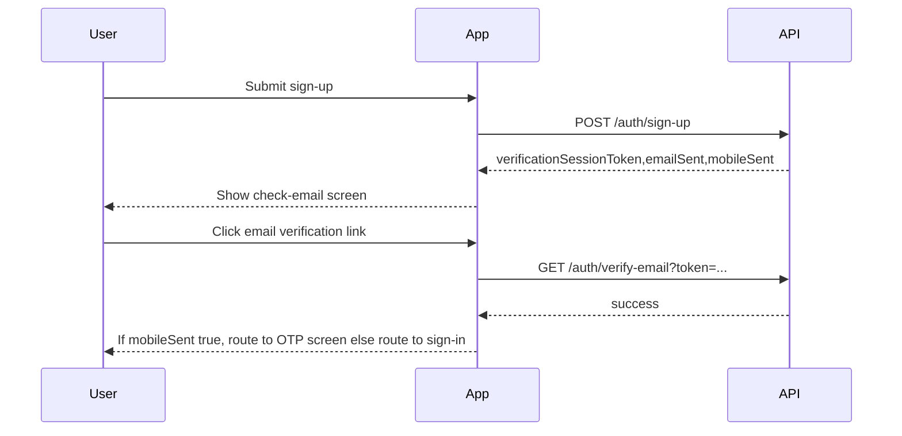

# Signup Verification Flow Plan

## Flow decisions

- After signup: always show a dedicated “check your email” screen (no OTP form).
- After email verification: if signup included a mobile number, route to OTP verification; otherwise send user to sign-in.

## UX flow

## Targeted changes

- Add a new “check your email” route and screen for signup success, or repurpose existing `auth.verify-mobile` to a read-only success view with a “Continue” CTA.
  - Update route tree in [`/Users/adambaser/Documents/portal.baser-it/app/lib/route-tree.ts`](file:///Users/adambaser/Documents/portal.baser-it/app/lib/route-tree.ts).
- Update signup action in [`/Users/adambaser/Documents/portal.baser-it/app/routes/auth/sign-up/auth.sign-up.route.tsx`](file:///Users/adambaser/Documents/portal.baser-it/app/routes/auth/sign-up/auth.sign-up.route.tsx) to redirect to the new “check your email” screen with query params (`verificationSessionToken`, `emailSent`, `mobileSent`).
- Update verify-email route in [`/Users/adambaser/Documents/portal.baser-it/app/routes/auth/verify-email/auth.verify-email.route.tsx`](file:///Users/adambaser/Documents/portal.baser-it/app/routes/auth/verify-email/auth.verify-email.route.tsx) to:
  - Read `mobileSent` and `verificationSessionToken` context (from query or storage).
  - On success, redirect to OTP verification when `mobileSent=true`, otherwise to sign-in.
- Update mobile OTP screen in [`/Users/adambaser/Documents/portal.baser-it/app/routes/auth/verify-mobile/auth.verify-mobile.route.tsx`](file:///Users/adambaser/Documents/portal.baser-it/app/routes/auth/verify-mobile/auth.verify-mobile.route.tsx) to be reached only after email verification and focus on OTP input.

## UI consistency

- Reuse existing auth components: `AuthFormContainer`, `AuthFormField`, `AuthFormButton` to match current auth UI patterns.
- Keep copy consistent with existing tone (Norwegian), emphasizing “check email” and “verify mobile if added.”

## Data handling decision

- Use query params to pass `verificationSessionToken`, `email
